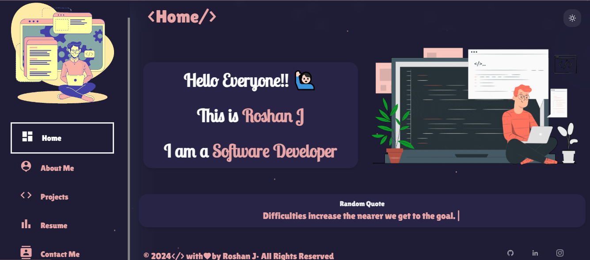

# Portfolio

Self Coded Portfolio Website made using React JS and Chakra UI.


<p align="center"> 
  <kbd>
    <a href="https://roshanj-portfolio.surge.sh/" target="_blank">
  </a>
  </kbd>
</p>

## Live Demo 

- Click [here](https://roshanj-portfolio.surge.sh/) to view the live demo.

## Features 📋

⚡️ Dark and Light Theme \
🎨 Customizable Layouts: Personalize your portfolio layout.\
📱  Responsive Design: Look great on desktop, tablet, and mobile.\
🏳️ Shimmering Effect and Lazy Loading of Images. \
💡  Edit with Ease: Light weight editing solution.\
💻 Downloadable React Code: Full control over your portfolio.


## Sections 📚

✔️ Home\
✔️ About Me\
✔️ Projects And Blogs\
✔️ Resume\
✔️ Contact Me

### Tech Stack 💻

- [React.js](https://react.dev/)
- [Chakra UI](https://chakra-ui.com/)


## Getting Started ⚡ :-

**1. Clone this repo by running the following command :-**

```bash
 git clone https://github.com/Rosh7an/Portfolio.git
```

**2. Now Install all the required packages by running the following commands :-**

```bash
 npm install
```

**3. Now start the React server by running the following command :-**

```bash
 npm start
```

**3.** **🎉 Open your browser and go to `https://localhost:3000`**

## Deployment 📦

This Web Application is deployed to Surge.

## License 📄
This project is licensed under the Apache-2.0 License - see the [LICENSE.md](./LICENSE) file for details


## Show your Support

Give a ⭐️ if you like this project!